# Spookyfin

[](https://jellyfin.org/)
[](https://m3.material.io/)
[](LICENSE)

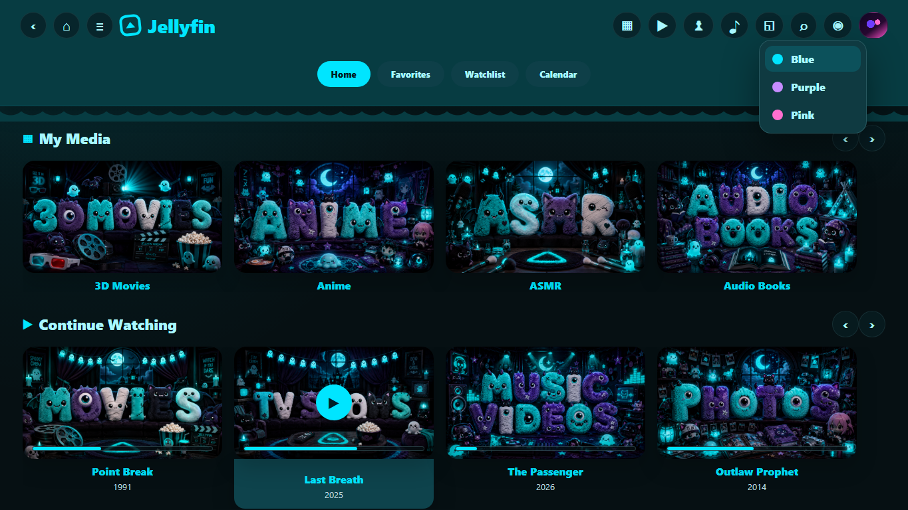

Spookyfin is a fast, rounded, cyan-accent Jellyfin custom CSS theme inspired by Material You, Android-style surfaces, and spooky-cute media library art.

It is built for people searching for:

`jellyfin theme`, `jellyfin custom css`, `material you jellyfin`, `android jellyfin theme`, `jellyfin dark theme`, `jellyfin library images`, `spooky jellyfin theme`, `media server theme`

## Features

- Material You inspired dark UI with bright cyan accent color.
- Rounded cards, buttons, dialogs, menus, and library tiles.
- Cleaner home rows with tinted card surfaces instead of heavy borders.
- Centered poster hover actions and better padding for badges and long titles.
- Safe rounded styling that avoids overriding Jellyfin's internal poster, blurhash, lazy-load, and card click layers.
- Included spooky-cute library artwork for Movies, Shows, Music, Collections, Anime, Cartoons, Audio Books, ASMR, Kids, Photos, Music Videos, Playlists, and an extra X library image.

## Who This Is For

Use Spookyfin if you want Jellyfin to feel more like a modern Android media app: rounded, fast, high contrast, touch friendly, and still clean enough for daily couch use.

## Install

1. Open Jellyfin.
2. Go to `Dashboard` -> `General`.
3. Find `Custom CSS code`.
4. Paste the contents of [`theme.css`](theme.css).
5. Save, then hard refresh your browser with `Ctrl+F5`.

Optional CDN install:

```css
@import url("https://cdn.jsdelivr.net/gh/endoflineservice/spookyfin@main/theme.css");
```

More details are in [docs/INSTALL.md](docs/INSTALL.md).

## Screenshots


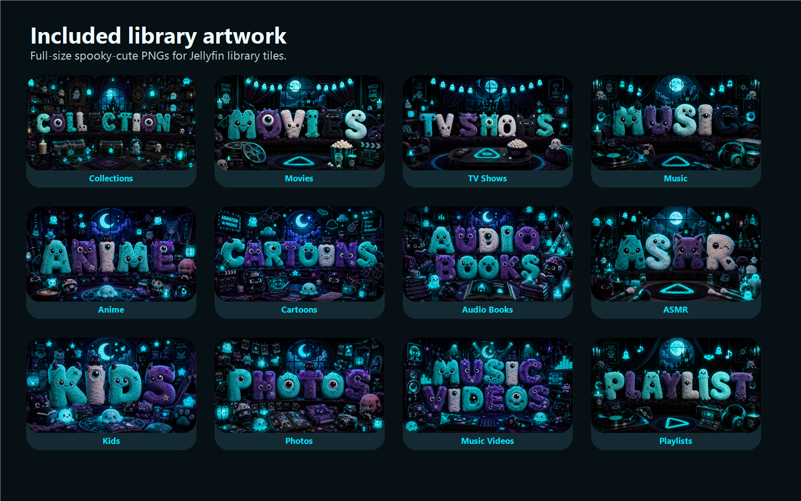

## Included Library Images

The full-size PNGs are in [`assets/library-images`](assets/library-images).

| Library | Image |
| --- | --- |
| Collections | 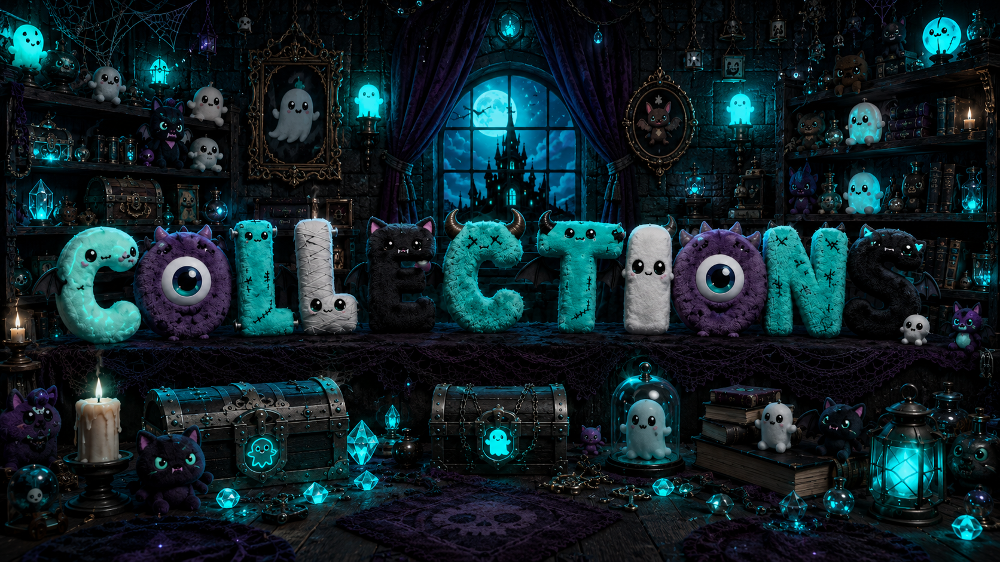 |
| Movies | 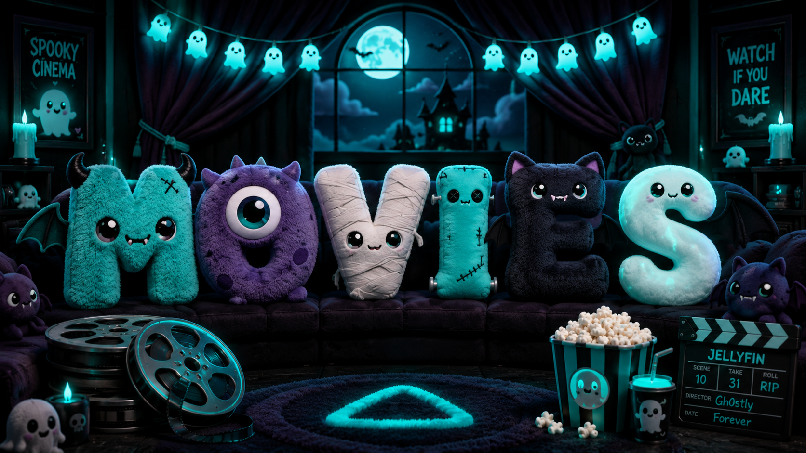 |
| TV Shows | 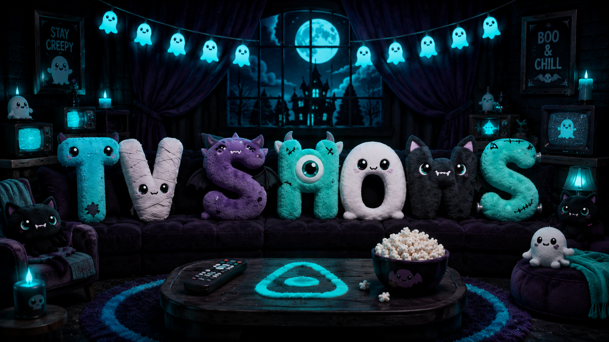 |
| Music | 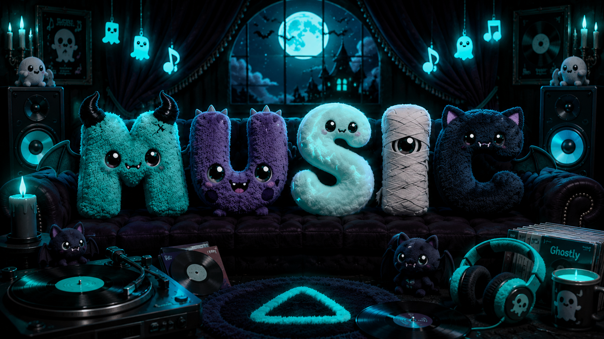 |
| Anime | 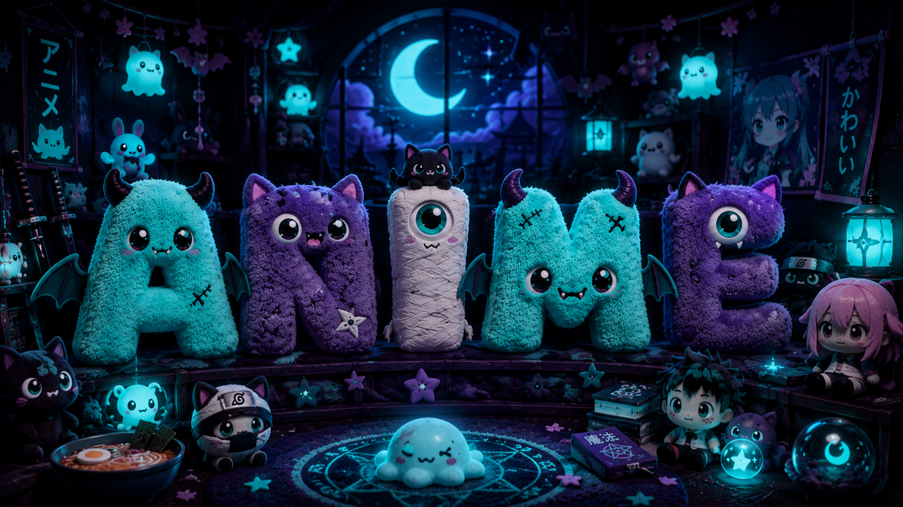 |
| Cartoons | 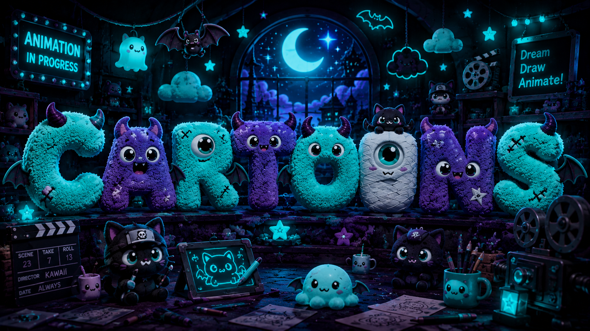 |
| Audio Books | 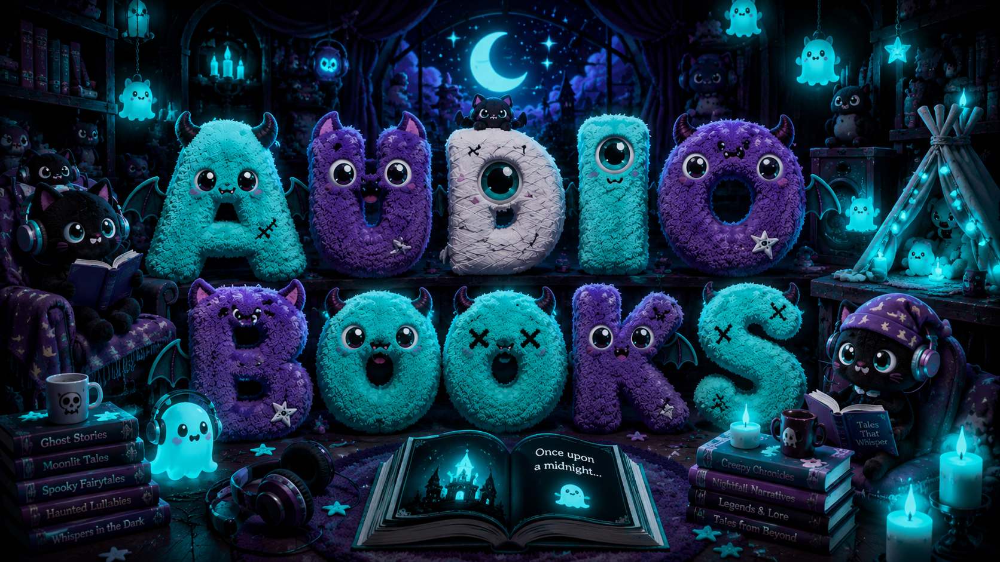 |
| ASMR | 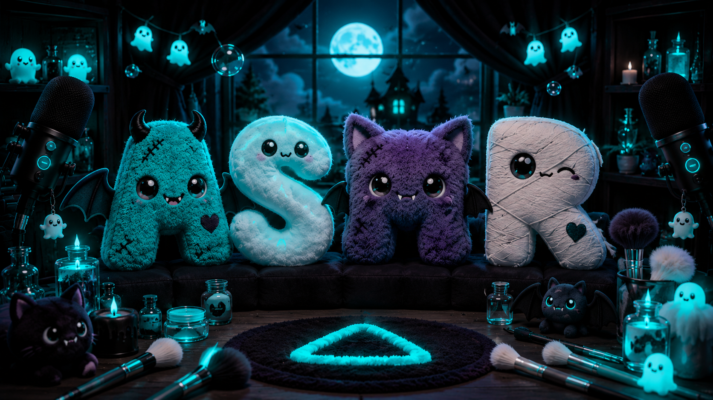 |
| Kids | 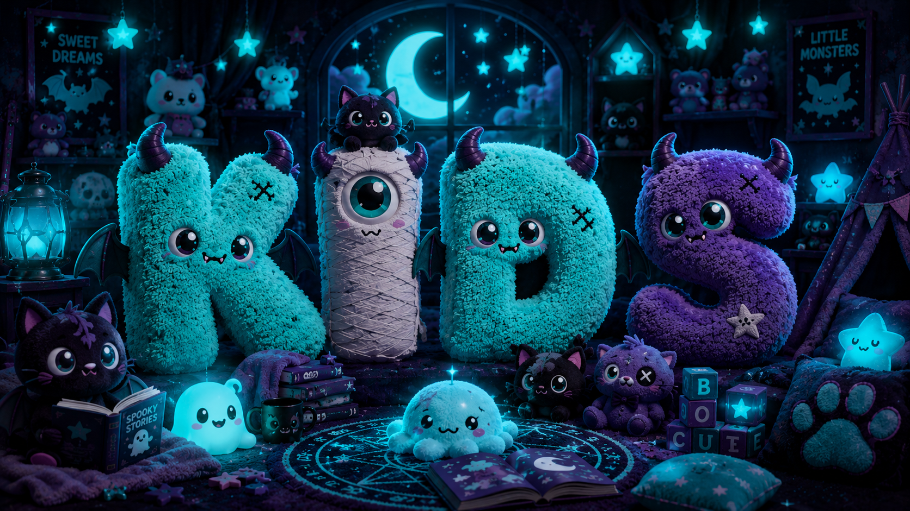 |
| Photos | 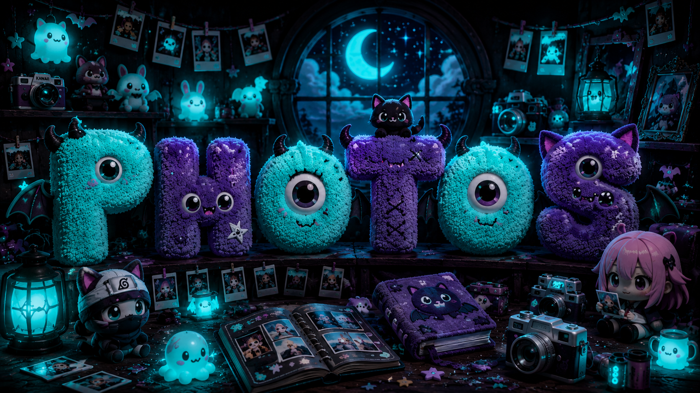 |
| Music Videos | 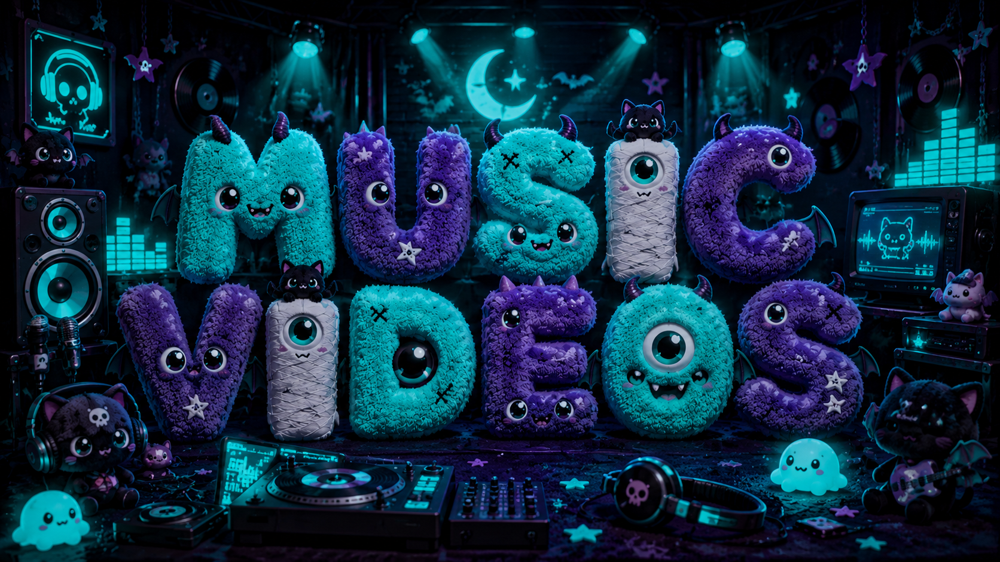 |
| Playlists | 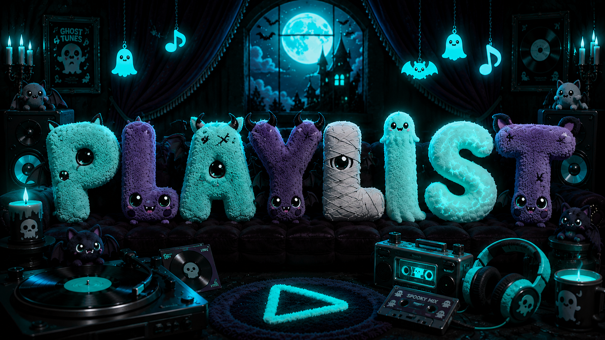 |
| X Library | 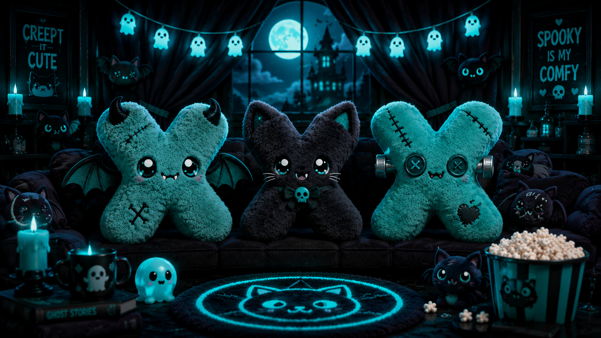 |

## Customize

Most of the personality lives in the first `:root` block of [`theme.css`](theme.css).

Change these variables to recolor the theme:

```css
:root {
  --my-primary: #00e5ff;
  --my-primary-2: #a9f7ff;
  --my-primary-container: #006b80;
  --my-bg: #071014;
  --my-surface: #101b20;
}
```

## Notes

- This is a Jellyfin custom CSS theme, not a server plugin.
- Tested against Jellyfin 10.11.x web UI.
- The theme intentionally keeps media image/click internals light so posters, libraries, and playback controls keep behaving like stock Jellyfin.
- Always keep a copy of your old custom CSS before replacing it.
- If posters look stale after installing, hard refresh the browser or clear Jellyfin web cache.

## License

MIT for the CSS, docs, and bundled artwork in this repository. See [LICENSE](LICENSE).
