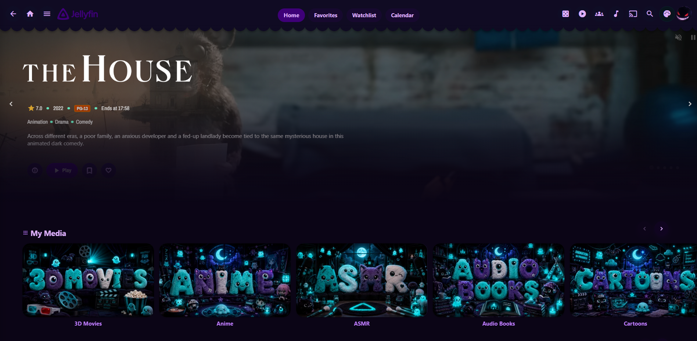
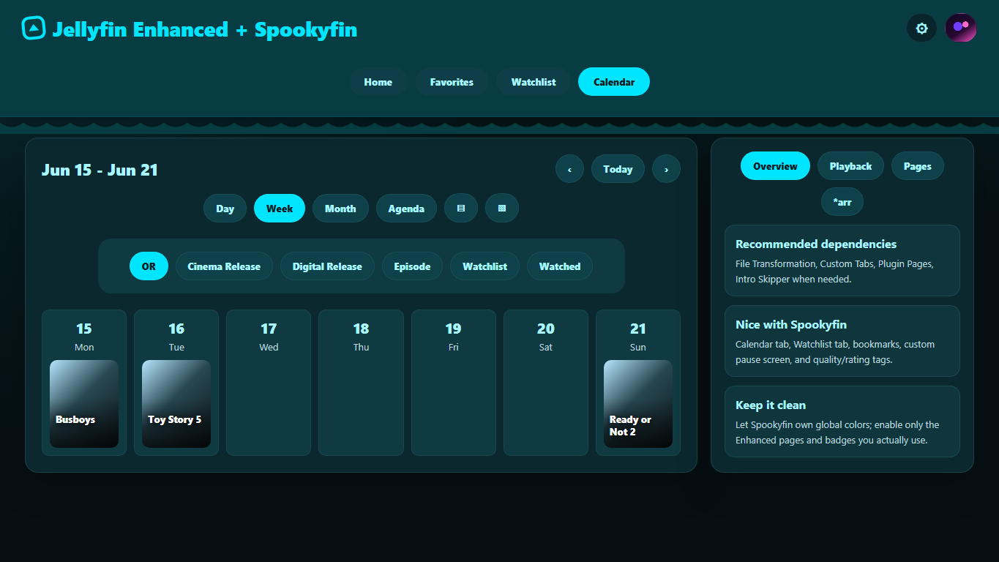
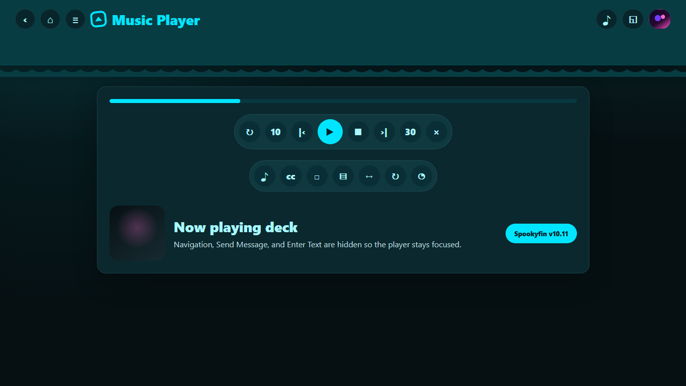
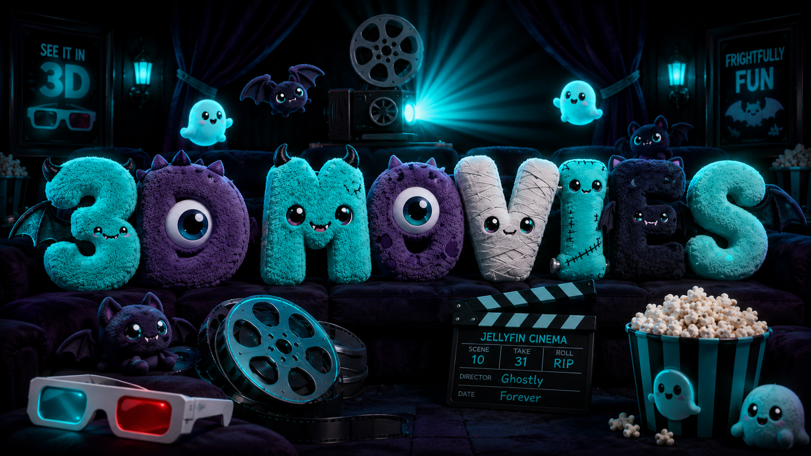

# Spookyfin

[](https://jellyfin.org/)
[](https://m3.material.io/)
[](LICENSE)



Spookyfin is a rounded Android/Material You inspired theme for Jellyfin Web. It keeps Jellyfin fast and readable while adding softer surfaces, pill controls, floating progress bars, a scalloped header, Material-style dialogs, and an optional header color switcher.

It is built for people searching for:

`jellyfin theme`, `jellyfin custom css`, `material you jellyfin`, `android jellyfin theme`, `jellyfin dark theme`, `jellyfin library images`, `spooky jellyfin theme`, `media server theme`

## Highlights

- Android-style dark surfaces with cyan as the default accent.
- Optional header palette button with Blue, Purple, and Pink color modes.
- Accent-linked card hover footers, row arrows, badges, and progress bars.
- Floating rounded Continue Watching progress bars.
- Centered card hover play buttons and Material FAB-style play actions.
- Softer rounded dialogs, menus, action sheets, settings lists, and form surfaces.
- Static scalloped top bar that follows the selected accent background.
- Home page image blanking repair for lazy-loaded Jellyfin card art.
- Included spooky-cute library artwork for common media libraries, including 3D Movies.
- Jellyfin Enhanced-friendly styling for custom tabs, calendar views, watchlist pages, and the remote/music player.

## Quick Setup Walkthrough

1. Install the CSS from [`theme.css`](theme.css) in Jellyfin's `Dashboard` -> `General` -> `Custom CSS code`.
2. Hard refresh Jellyfin with `Ctrl+F5`.
3. Add [`spookyfin-helper.js`](spookyfin-helper.js) to Jellyfin Web if you want the accent button, custom home rows, image repair, and custom tab cleanup.
4. Upload the matching images from [`assets/library-images`](assets/library-images) to your Jellyfin libraries.
5. Optional: install [Jellyfin Enhanced](https://github.com/n00bcodr/Jellyfin-Enhanced), then enable only the tabs and pages you use.
6. Restart Jellyfin after plugin or helper changes, then hard refresh again.

More detailed steps are in [docs/INSTALL.md](docs/INSTALL.md).

## Install

### CSS theme

1. Open Jellyfin.
2. Go to `Dashboard` -> `General`.
3. Find `Custom CSS code`.
4. Paste the contents of [`theme.css`](theme.css).
5. Save, then hard refresh your browser with `Ctrl+F5`.

Optional CDN install:

```css
@import url("https://cdn.jsdelivr.net/gh/endoflineservice/spookyfin@main/theme.css");
```

### Optional helper script

[`spookyfin-helper.js`](spookyfin-helper.js) powers the header color button, home row ordering, and image rehydration behavior. Jellyfin's Custom CSS box cannot run JavaScript, so the helper must be loaded as a web client script.

The usual Docker/custom-image approach is:

```powershell
docker cp .\spookyfin-helper.js jellyfin:/jellyfin/jellyfin-web/spookyfin-helper.js
```

Then add this before Jellyfin's app bundle scripts in `/jellyfin/jellyfin-web/index.html`:

```html
<script defer="defer" src="spookyfin-helper.js?spookyfin=20260616"></script>
```

More details are in [docs/INSTALL.md](docs/INSTALL.md).

## Screenshots






## Jellyfin Enhanced Recommendations

Spookyfin works well with [Jellyfin Enhanced](https://github.com/n00bcodr/Jellyfin-Enhanced), but keep the plugin setup focused so the UI stays clean.

Recommended companion plugins from the Jellyfin Enhanced project:

- `File Transformation`: recommended for safer web-file modifications.
- `Custom Tabs`: use this for top navigation entries such as `Watchlist` and `Calendar`.
- `Plugin Pages`: useful when Enhanced pages need to appear as real Jellyfin pages.
- `Kefin Tweaks`: optional, mostly useful if you want the extra watchlist tooling.

Suggested Enhanced settings:

- Enable `Bookmarks`, `Custom Pause Screen`, and `Tab-switch actions`.
- Add `Watchlist` and `Calendar` as custom tabs if you use them.
- Connect Radarr/Sonarr in the `*arr` section before expecting the calendar to show useful release data.
- Leave extra theme/CSS features off unless you specifically need them; Spookyfin should own the global colors and surfaces.
- Use media tags and badges lightly. Spookyfin styles them, but too many badges can crowd rows.

See [docs/enhanced-plugin.md](docs/enhanced-plugin.md) for the setup notes.

## Included Library Images

The full-size PNGs are in [`assets/library-images`](assets/library-images).

| Library | Image |
| --- | --- |
| Collections |  |
| 3D Movies |  |
| Movies |  |
| TV Shows |  |
| Music |  |
| Anime |  |
| Cartoons |  |
| Audio Books |  |
| ASMR |  |
| Kids |  |
| Photos |  |
| Music Videos |  |
| Playlists |  |
| X Library |  |

## Customize

Blue is the default accent. If you use the helper script, the header palette button can switch between Blue, Purple, and Pink per browser.

For CSS-only installs, recolor the first `:root` block in [`theme.css`](theme.css):

```css
:root {
  --my-primary: #00e5ff;
  --my-primary-2: #a9f7ff;
  --my-primary-container: #006b80;
}
```

## Notes

- The core theme is Jellyfin custom CSS, not a server plugin.
- The color switcher and image rehydration behavior require the optional helper script.
- Tested against Jellyfin 10.11.x Web UI.
- Always keep a copy of your old custom CSS before replacing it.
- If the UI looks stale after installing, hard refresh with `Ctrl+F5` or clear Jellyfin web cache.

## License

MIT for the CSS, helper script, docs, and bundled artwork in this repository. See [LICENSE](LICENSE).
